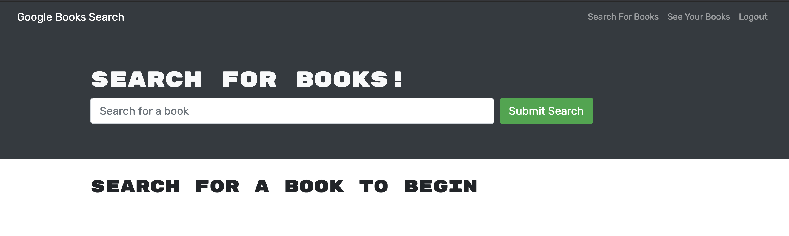

# Book Search

## Description: 

This application allows users to sign up for an account so they can save books they have searched. This app uses the Google Book Search API to retreive information and display when a book is search. The back end of the site uses GraphQL. Front end is created using React and Bootstrap for styling.

## Table of Contents
* [Built With](#builtwith)
* [Screenshots](#screenshots)
* [Contributing](#contributing)
* [Questions](#questions)

## Built With
* GraphQL
* React
* Mongoose
* MongoDB
* bcrypt
* Express.js
* Node.js

## Screenshots

* Homepage

* Login/SignUp Page

* Search Results 

* Saved Books

